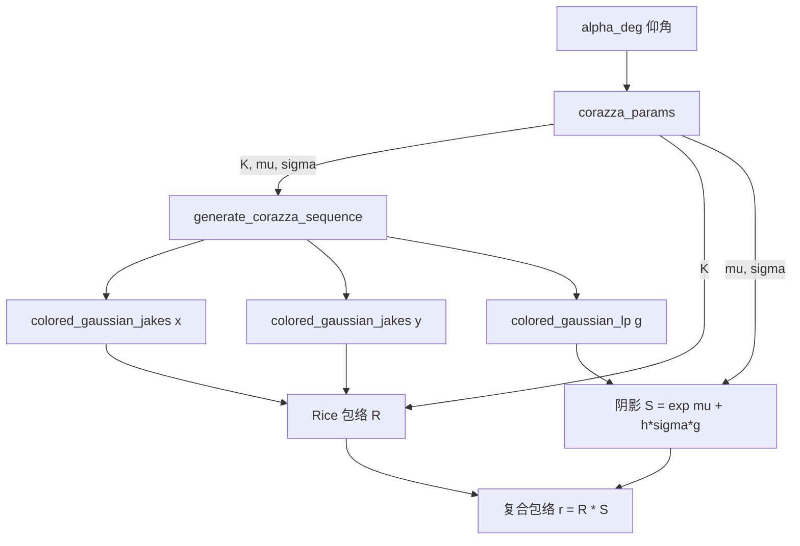
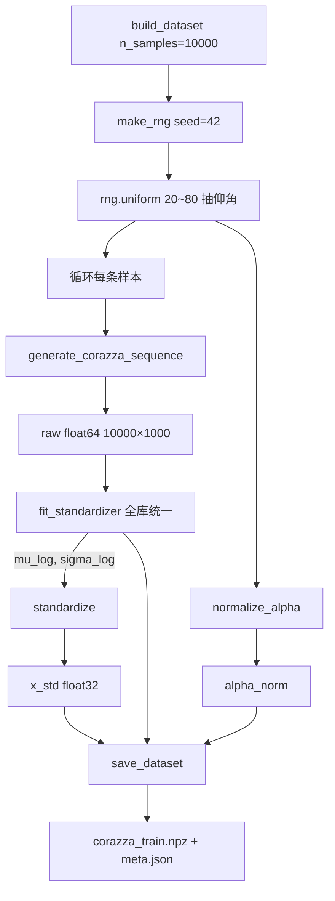
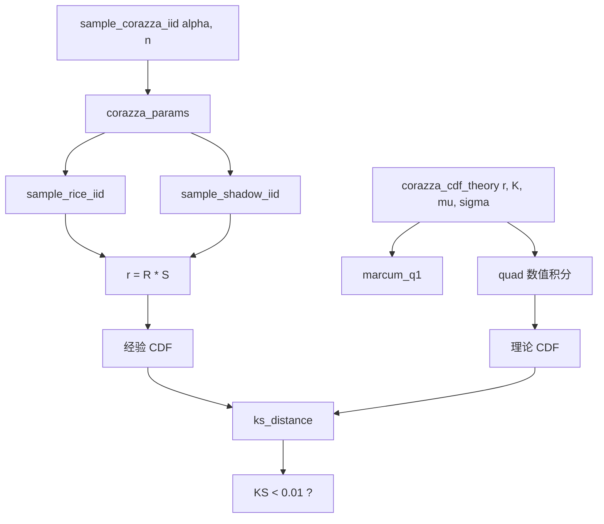
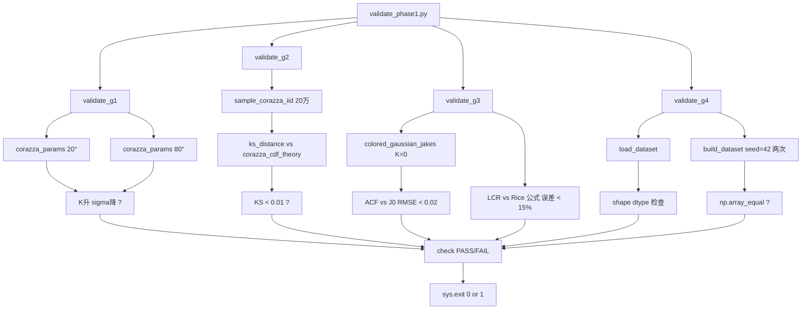
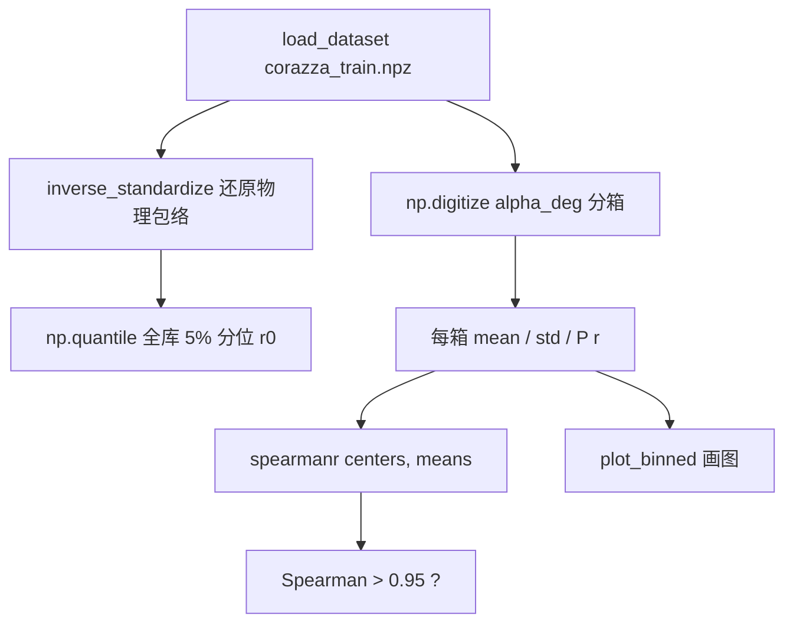

# 阶段一函数清单与调用流程图

> 整理日期：2026-09-23
> 覆盖文件：`corazza.py` / `transforms.py` / `dataset.py` / `seed.py` / `validate_phase1.py` / `day5_binned_stats.py`
> 用途：快速查阅函数签名、参数、返回值，理解数据从仰角到数据集的完整链路。

---

## 一、函数总表

### 1.1 `generative/data/corazza.py` — Corazza 模型核心

| 函数名 | 功能 | 可填参数 | 返回值 |
|--------|------|----------|--------|
| `corazza_params` | 仰角→(K, μ, σ) 三参数 | `alpha_deg` (度, float/array), `check_range=True` | `(K, mu, sigma)` |
| `sample_rice_iid` | 采样 n 个归一化 Rice 包络 R | `n` (int), `K_lin` (线性莱斯因子), `rng` | `np.ndarray` shape (n,) |
| `sample_shadow_iid` | 采样 n 个 Lognormal 阴影 S | `n`, `mu_Np` (奈培), `sigma_dB` (dB), `rng` | `np.ndarray` shape (n,) |
| `sample_corazza_iid` | 采样 n 个复合包络 r=R·S（i.i.d.） | `alpha_deg`, `n`, `rng` | `np.ndarray` shape (n,) |
| `marcum_q1` | 一阶 Marcum Q 函数 Q1(a,b) | `a`, `b` (非负实数) | `float` ∈ [0,1] |
| `corazza_cdf_theory` | 复合包络理论 CDF（数值积分） | `r` (门限), `K_lin`, `mu_Np`, `sigma_dB` | `float` ∈ [0,1] |
| `colored_gaussian_jakes` | Jakes 谱着色高斯噪声 | `n`, `fs` (Hz), `fd` (Hz), `rng` | `np.ndarray` shape (n,) |
| `colored_gaussian_lp` | 一阶 IIR 低通高斯噪声 | `n`, `fs`, `tau_c` (秒), `rng` | `np.ndarray` shape (n,) |
| `generate_corazza_sequence` | 生成一条 Corazza 时序序列 | `alpha_deg`, `length=1000`, `fs=1000.0`, `fd=50.0`, `tau_shadow=0.3`, `rng=None` | `np.ndarray` shape (length,) |

### 1.2 `generative/data/transforms.py` — 标准化与归一化

| 函数名 | 功能 | 可填参数 | 返回值 |
|--------|------|----------|--------|
| `fit_standardizer` | 从样本估计 log 域均值/标准差 | `samples` (任意形状), `eps=1e-6` | `(mu_log, sigma_log)` 两个标量 |
| `standardize` | 原始包络→标准化 x | `r`, `mu_log`, `sigma_log`, `eps=1e-6` | 与 r 同形状 |
| `inverse_standardize` | 标准化 x→原始包络 r | `x`, `mu_log`, `sigma_log`, `eps=1e-6` | 与 x 同形状 |
| `normalize_alpha` | 仰角归一化到 [-1,1] | `alpha_deg` | 同形状 |
| `denormalize_alpha` | [-1,1]→角度 | `alpha_norm` | 同形状 |

### 1.3 `generative/data/dataset.py` — 数据集构建与加载

| 函数/类 | 功能 | 可填参数 | 返回值 |
|---------|------|----------|--------|
| `build_dataset` | 生成并标准化数据集 | `n_samples=10000`, `length=1000`, `seed=42`, `fs=1000.0`, `fd=50.0`, `tau_shadow=0.3`, `alphas=None` | `dict` (x_std, alpha_norm, alpha_deg, mu_log, sigma_log, eps) |
| `save_dataset` | 存 npz + meta.json | `data`, `out_dir`, `npz_name="corazza_train.npz"`, `meta_name="corazza_train_meta.json"`, `seed`, `fs`, `fd`, `tau_shadow` | None |
| `load_dataset` | 读 npz | `npz_path` | `dict` |
| `CorazzaDataset` | PyTorch Dataset 封装 | `npz_path` | Dataset 对象，`ds[idx]` 返回 `(x_tensor, alpha_tensor)` |

### 1.4 `generative/utils/seed.py` — 随机种子

| 函数名 | 功能 | 可填参数 | 返回值 |
|--------|------|----------|--------|
| `make_rng` | 创建 numpy 随机生成器 | `seed=42` | `np.random.Generator` |
| `seed_everything` | 固定 numpy/python/torch 种子 | `seed=42` | `np.random.Generator` |

### 1.5 `generative/data/validate_phase1.py` — 一键验收

| 函数名 | 功能 | 可填参数 | 返回值 |
|--------|------|----------|--------|
| `check` | 记录并打印检查结果 | `name`, `ok` (bool), `detail=""` | None（追加到全局 CHECKS） |
| `ks_distance` | 经验 CDF vs 理论 CDF 的 KS 距离 | `samples` (np.ndarray), `theory_cdf` (callable) | `float` |
| `validate_g1` | G1 参数曲线合理性 | 无 | None |
| `validate_g2` | G2 i.i.d. CDF KS | 无 | None |
| `validate_g3` | G3 ACF + LCR | 无 | None |
| `validate_g4` | G4 数据集固化 | 无 | None |

### 1.6 `scripts/day5_binned_stats.py` — 分箱统计

| 函数名 | 功能 | 可填参数 | 返回值 |
|--------|------|----------|--------|
| `binned_stats` | 按仰角分箱统计 mean/std/深衰落概率 | `data` (dict), `bin_width=10.0` | `dict` (centers, means, stds, p_deep, spearman) |
| `plot_binned` | 画 mean±std vs 仰角图 | `result` (dict) | None（存图） |
| `build_alpha75_ref` | 生成 75° 参考样本 | `n_ref=50` | None（存 npz） |

---

## 二、核心调用流程图

### 2.1 从仰角到一条时序序列



### 2.2 从仰角到完整数据集



### 2.3 静态分布采样与理论 CDF 裁判



### 2.4 一键验收脚本 validate_phase1.py



### 2.5 分箱统计与单调性验证



---

## 三、关键参数速查

### 3.1 仰角参数 corazza_params 返回值

| 仰角 | K（线性） | μ（Np） | σ（dB） |
|------|-----------|---------|---------|
| 20° | 1.69 | -0.49 | 3.50 |
| 50° | 5.58 | -0.12 | 2.00 |
| 80° | 11.89 | 0.18 | 0.50 |

### 3.2 时序参数默认值（复现设定，非学长论文给定）

| 参数 | 默认值 | 出处 |
|------|--------|------|
| fs（采样率） | 1000 Hz | 复现设定 |
| fd（最大多普勒） | 50 Hz | 复现设定 |
| tau_shadow（阴影相关时间） | 0.3 s | 复现设定 |
| length（序列长度） | 1000 | 学长论文 |

### 3.3 数据集参数

| 参数 | 值 |
|------|-----|
| n_samples | 10000 |
| length | 1000 |
| seed | 42 |
| dtype | float32（存储）/ float64（生成） |
| 文件大小 | 40.1 MB |

### 3.4 标准化常量

| 常量 | 值（全库统一） |
|------|----------------|
| mu_log | 约 -0.3（具体见 meta.json） |
| sigma_log | 约 0.8（具体见 meta.json） |
| eps | 1e-6 |

---

## 四、典型调用示例

### 4.1 生成一条时序序列

```python
from generative.data.corazza import generate_corazza_sequence
from generative.utils.seed import make_rng

rng = make_rng(42)
r = generate_corazza_sequence(alpha_deg=45.0, length=1000, rng=rng)
# r.shape == (1000,)，单位是线性幅度
```

### 4.2 生成完整数据集并存盘

```python
from generative.data.dataset import build_dataset, save_dataset

data = build_dataset(n_samples=10000, seed=42)
save_dataset(data, out_dir="datasets", seed=42)
# 生成 datasets/corazza_train.npz + corazza_train_meta.json
```

### 4.3 标准化往返

```python
from generative.data.transforms import fit_standardizer, standardize, inverse_standardize

mu_log, sigma_log = fit_standardizer(raw)  # raw 是全库原始包络
x_std = standardize(raw, mu_log, sigma_log)
r_recovered = inverse_standardize(x_std, mu_log, sigma_log)
# np.allclose(raw, r_recovered) 应为 True
```

### 4.4 用 PyTorch Dataset 训练

```python
from generative.data.dataset import CorazzaDataset
from torch.utils.data import DataLoader

ds = CorazzaDataset("datasets/corazza_train.npz")
loader = DataLoader(ds, batch_size=64, shuffle=True)
for x, alpha in loader:
    # x.shape == (64, 1000), alpha.shape == (64,)
    ...
```

### 4.5 一键验收

```bash
cd leo_channel_simulator/leo_channel_simulator
python generative/data/validate_phase1.py
# 期望输出：阶段一验收：13/13 PASS
```

### 4.6 分箱统计

```python
from generative.data.dataset import load_dataset
from scripts.day5_binned_stats import binned_stats, plot_binned

data = load_dataset("datasets/corazza_train.npz")
result = binned_stats(data)
plot_binned(result)
# 输出 Spearman 相关系数，存 figs/p1_mean_std_vs_alpha.png
```
